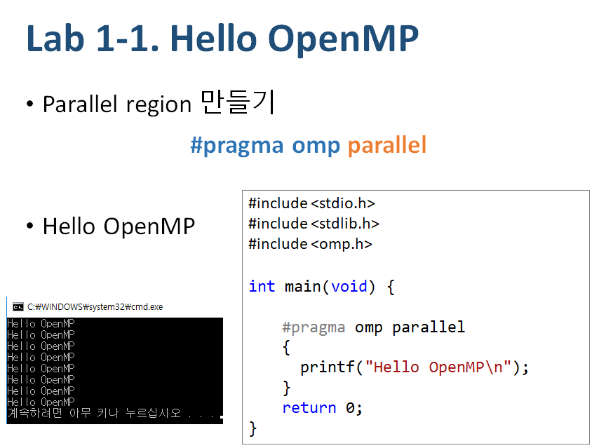

# [CPH351](http://hpc.koreatech.ac.kr/course_mp.html) Multi-core programming, [KOREATECH](https://www.koreatech.ac.kr/)



- Hints

```cpp
#pragma omp parallel num_threads(numThreads)
{
	printf("[Thread %d/%d] Hello OpenMP!\n"
		, omp_get_thread_num(), omp_get_num_threads());
}
```

- Sample Output

```
[Thread 1/4] Hello OpenMP!
[Thread 3/4] Hello OpenMP!
[Thread 2/4] Hello OpenMP!
[Thread 4/4] Hello OpenMP!
```