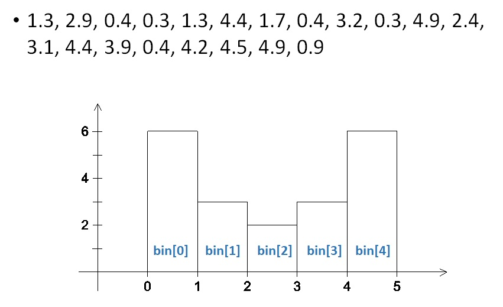
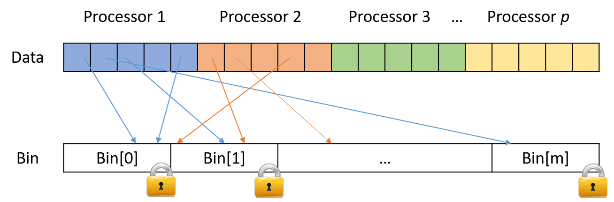
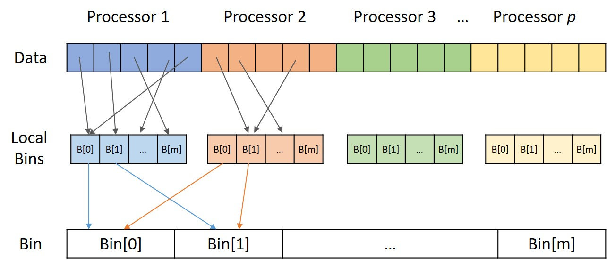
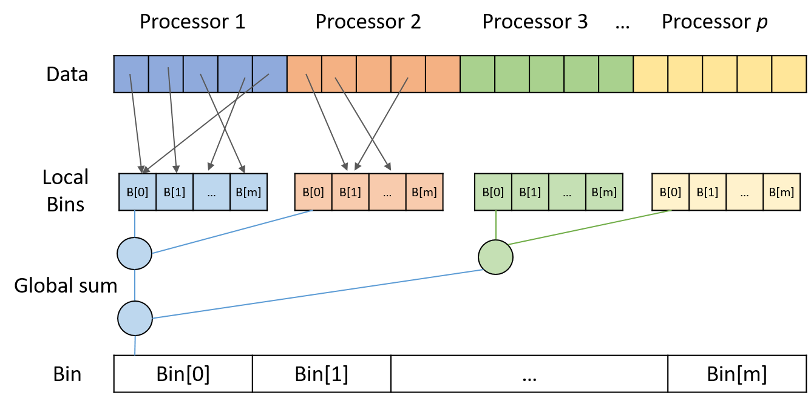
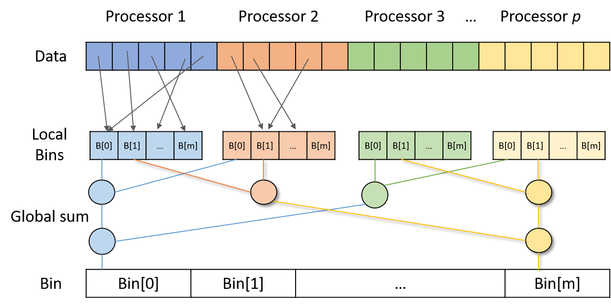

### Parallel Histogram Construction

#### Problem

- Input : $(1024^3)$ floating point numbers
- 10 Bins : 0-1, 1-2, ... , 9-10

---

#### Implemented algorithms

- **Serial algorithm**
- **Parallel algorithm with critical section or locking (Ver 1)**
    - **Ver 1-1.** Using a critical section for accessing the bins
      {: width="400"}
    - **Ver 1-2.** Using a lock for each bin
      {: width="400"}
- **Parallel algorithm with Local bins (Ver 2)**
  {: width="400"}
    - **Ver 2-1.** Collecting the local bins in serial
    - **Ver 2-2.** Collecting the local bins in parallel
- **Parallel algorithm with the reduction (Ver 3)**
    - **Ver 3-1.** Doing reduction for each bin one-by-one
      {: width="400"}
    - **Ver 3-2.** Doing reduction for multiple bins in parallel
      {: width="400"}

---

### Performance Test

- Testing environment
    - Intel i7-8700 Quad-core CPU, 32GB memory, Windows 10
        - Use 4 threads for parallel algorithms
- Performance (Sample result)

    | Serail | Ver 1-1 | Ver 1-2 | Ver 2-1 | Ver 2-2 | Ver 3-1 | Ver 3-2 |
    |:------:|:------:|:------:|:------:|:------:|:------:|:------:|
    |606.67 ms|152317.27 ms| 56973.69 ms | 270.60 ms | 256.10 ms| 274.79 ms| 252.59 ms |
    |1.0 x|0.004 x|0.010 x|2.25 x|2.38 x|2.22 x|2.41 x|